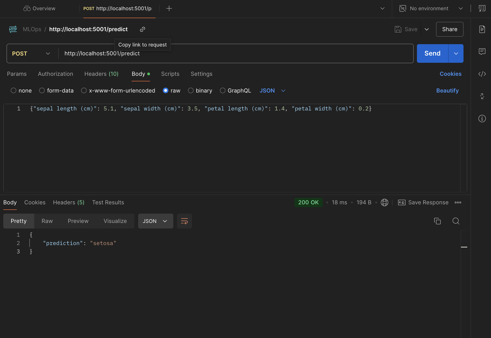
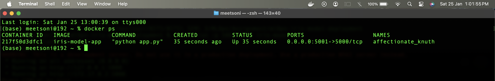

# Iris Flower Classification - Model Deployment

This project demonstrates the training, packaging, and deployment of a machine learning model for classifying iris flowers. The model is trained using the classic Iris dataset and a Random Forest classifier. Hyperparameter tuning is performed using `GridSearchCV` to find the best model parameters. The trained model is then packaged into a Docker container along with a Flask web application that serves the model's prediction functionality through a REST API.

## Project Structure


mlOps-iris-model-deployment/
├── app.py             # Flask application code
├── Dockerfile         # Docker image definition
├── hyperparameter_tuning_report.csv # Report of hyperparameter tuning results
├── iris_model.pkl     # Saved trained model
├── requirements.txt   # Python dependencies
├── screenshots/       # Folder containing screenshots
│   ├── docker_running.png     # Screenshot of the Docker container running
│   └── prediction_output.png  # Screenshot of a successful prediction
└── README.md          # This file


## Hyperparameter Tuning Report

The hyperparameter tuning process was performed using `GridSearchCV` with 3-fold cross-validation. The following hyperparameters of the `RandomForestClassifier` were tuned:

- `n_estimators`
- `max_depth`
- `min_samples_split`
- `min_samples_leaf`

**Results:**

- **Best Hyperparameters:**
    - `n_estimators`: 100
    - `max_depth`: 30
    - `min_samples_split`: 2
    - `min_samples_leaf`: 1
- **Best Cross-Validation Score (Accuracy):** 0.958
- **Observations:**
    - Increasing `n_estimators` generally improved performance, but the improvement plateaued after 100.
    - Deeper trees (`max_depth`) tended to perform better, with the best results at `max_depth` of 30 or None.
    - The default values for `min_samples_split` (2) and `min_samples_leaf` (1) worked well.

## Running the Model with Docker

1.  **Build the Docker image:**
    ```bash
    docker build -t iris-model-app .
    ```

2.  **Run the Docker container:**
    ```bash
    docker run -p 5001:5000 iris-model-app
    ```

3.  **Send a test request (using curl):**
    ```bash
    curl -X POST \
      http://localhost:5001/predict \
      -H 'Content-Type: application/json' \
      -d '{"sepal length (cm)": 5.1, "sepal width (cm)": 3.5, "petal length (cm)": 1.4, "petal width (cm)": 0.2}'
    ```

## Screenshots

**Prediction Output:**



**Docker Container Running:**

